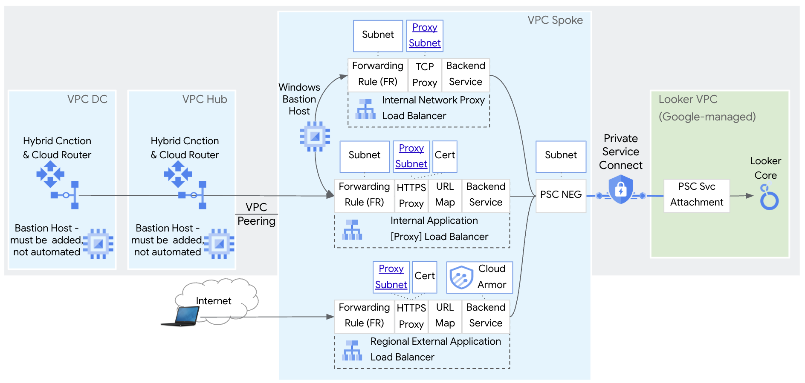
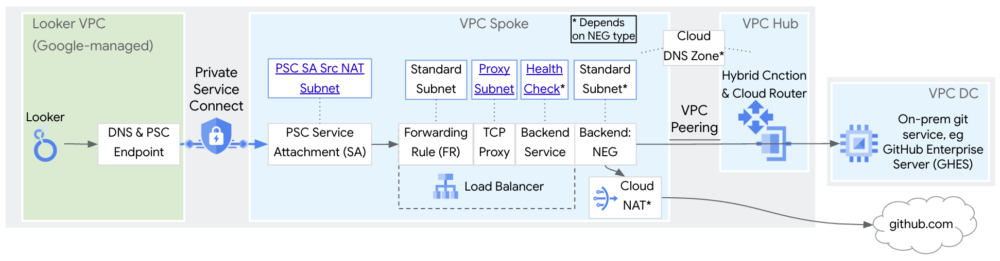

# Private Access to Looker Core Northbound and Southbound
This repo contains instructions and a Terraform script to build Private Northbound and Private Southbound networking for Looker Core in an isolated Google Cloud environment. 

The script builds Northbound architecture with 1 or 3 load balancers depending if the path to a cert file and private key are added to the tfvars files (instructions below).  

The script builds Southbound architecture with a single Internal network proxy load balancer for Looker Core to reach Git services via SSH.

See the architecture images for more details...

**Northbound Architecture - Option #1 - 1 Load balancer**\
**Internal network proxy load balancer only, no cert provided, no TLS termination on load balancer**


**Northbound Architecture - Option #2 - 3 Load balancers**\
**Must add trusted cert for Application load balancers to be created**


**Southbound Architecture**


## Notes
1. The intent of this repo is to create a fixed, isolated environment for learning, demonstration and Proof of Concept (PoC), **not production**.
2. The Terraform script sets to "not enforced" the [Google Cloud org policies](https://cloud.google.com/resource-manager/docs/organization-policy/using-constraints) constraints/compute.requireShieldedVm and disableInternetNetworkEndpointGroup at the project level, and sets to "allow all" for org policies trustedImageProjects and restrictVpnPeerIPs at the project level, so the script may not be appropriate for highly regulated environments.
3. The actions taken by deploying this repo will add cost. To minimize costs, instructions are provided for how to teardown the demo environment when you're finished using it. For more on cost, please refer to Google Cloud public pricing pages for components such as Internal and External Load Balancers, Private Service Connect, Reserved IP Addresses, Data Transfer, Certificate Manager, etc.
4. There are 3 gcloud commands run in the Terraform script since there is no Terraform equivalent of these commands without creating Looker from Terraform (something this script does not do). All 3 commands are based on [gcloud looker instances update](https://cloud.google.com/sdk/gcloud/reference/looker/instances/update) and do the following: 1) [Update VPCs allowed to reach Looker Core northbound](https://cloud.google.com/sdk/gcloud/reference/looker/instances/update#--psc-allowed-vpcs), 2) [Update DNS and PSC Service Attachment URI in Looker VPC for Southbound](https://cloud.google.com/sdk/gcloud/reference/looker/instances/update#--psc-service-attachment), 3) [Update customer domain for Looker Core](https://cloud.google.com/sdk/gcloud/reference/looker/instances/update#--custom-domain) (see [custom domain](https://cloud.google.com/looker/docs/looker-core-psc-access#create_a_custom_domain_2) for more information).


## Prerequisites
1. Make sure the following tools are available in your terminal's $PATH ([Cloud Shell](https://cloud.google.com/shell/docs/how-cloud-shell-works) has these preconfigured)
    * [gcloud CLI SDK](https://cloud.google.com/sdk/docs/install)
    * terraform
2. Must be using Terraform **version 1.10 or above**. Run the `terraform --version` command to verify version. If needed, upgrade instructions here: https://www.tecmint.com/install-terraform-in-linux/
3. Project-level permissions needed to run the script:\
   a. Permission: serviceusage.services.enable. Role: Service Usage Admin (roles/serviceusage.serviceUsageAdmin)\
   b. Permission: compute.networks.create. Role: Compute Network Admin (roles/compute.networkAdmin)\
   c. Permissions: compute.regionNetworkEndpointGroups.create, compute.firewalls.create, compute.disks.create, compute.instances.create. Role: Compute Admin (roles/compute.admin)\
   d. Permission: looker.instances.update. Role: Looker Admin (roles/looker.admin)
4. Org-level permissions needed to run the script: Organization Policy Administrator (roles/orgpolicy.policyAdmin)


## Setup and Deploy the script

To deploy the script, follow this process:
1. Clone the this repo using the tool of your choice, eg CLI on your machine, [Cloud Shell](https://cloud.google.com/shell/docs/how-cloud-shell-works), VS Code, etc.
```sh
git clone https://github.com/kurtradecki/gcp-pa-psc-looker-demo.git
```
2. Ensure you have an active GCP account selected to run gcloud commands with [gcloud CLI SDK](https://cloud.google.com/sdk/docs/install) (not needed in [Cloud Shell](https://cloud.google.com/shell/docs/how-cloud-shell-works)).
```sh
gcloud auth login
gcloud auth application-default login
```
3. Create a project in GCP, if not already created. Reference if needed [Creating and managing projects](https://cloud.google.com/resource-manager/docs/creating-managing-projects)
4. Follow these instructions to create a PSC-based Looker Core instance: [Create a Private Service Connect Looker instance](https://cloud.google.com/looker/docs/looker-core-create-psc#create_instance)
5. In the gcp-pa-psc-looker-demo directory, rename example.tfvars to terraform.tfvars
6. Capture the following information for the terraform.tfvars file:\
   a. Infrastructure Project ID (infra_project_id)\
   b. Looker Project ID (looker_project_id)\
   c. Looker Core instance name (svc_instance_name)\
   d. Looker Core PSC service attachment URI (svc_sa)\
   e. FQDN / Custom Domain for Looker Core (svc_name & svc_dns_domain)\
   f. If you plan to add a cert for application load balancers, the cert file path and cert private key file path (cert_path & cert_private_key_path)\
   g. If you plan to add a cert for an external application load balancer, Public IPs to allow through Cloud Armor for External application load balancer 
8. In terraform.tfvars, add the values for variables that need values (see the file for which). All other values can stay the same unless customization required. Reference if needed for how to find project ID, see [Find the project name, number, and ID](https://cloud.google.com/resource-manager/docs/creating-managing-projects#identifying_projects)
9. At the command prompt where you'll run the script, in the Terraform directory, run:
```sh 
terraform init
terraform plan
terraform apply -auto-approve
```
8. Wait a 15-20 minutes for the script to complete (setting Looker custom domain takes 10-15 minutes). You'll see a message similar to "Apply complete!" and then move to the next section.\
Note: Most of the time for the script to run is updating Looker Core custom domain which "takes 10 to 15 minutes to complete", from [Create a custom domain](https://cloud.google.com/looker/docs/looker-core-psc-access#create_a_custom_domain_2).

## Troubleshooting

**Terraform script errors**\
Most errors in this Terraform script can be cleared by running the `terraform plan` and `terraform apply -auto-approve` again. 

This script includes gcloud commands in the Terraform script. In general, gcloud commands in a Terraform script can at times return a long error message that includes the following error: "local-exec provisioner error" and "unable to queue operation since queue fifo_queue is full according to queue". Same as mentioned, re-running the terraform commands `terraform plan` and `terraform apply -auto-approve` will clear the error. 

**DNS for External application load balancer**\
To operate, the External application load balancer requires DNS to be updated for the FQDN (svc_name & svc_dns_domain) to resolved to the external IP address of the forwarding rule. 


## Conclusion & Cleanup

Congratulations! You've successfully deployed the script.

To delete the created infrastructure, run the following command:

```sh
terraform destroy -auto-approve
```

Wait a few minutes for the components created by the Terraform script to be removed. You'll see a message similar to "Destroy complete!" 
