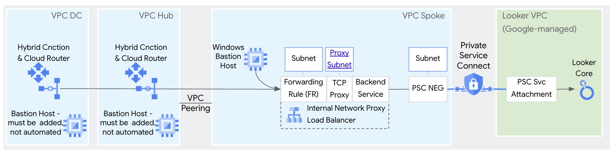

# Private Access to Looker Core Northbound and Southbound
This repo contains instructions and a Terraform script to build Private Northbound and Private Southbound networking for Looker Core in an isolated Google Cloud environment. 

The script builds Northbound architecture with 1 or 3 load balancers depending if the path to a cert file and private key are added to the tfvars files (instructions below).  

The script builds Southbound architecture with a single Internal network proxy load balancer for Looker Core to reach Git services via SSH.

See the architecture images for more details...

**Northbound Architecture - Option #1 - 1 Load balancer 
Internal network proxy load balancer only, no cert provided, no TLS termination on load balancer**


**Northbound Architecture - Option #2 - 3 Load balancers
Must add trusted cert for Application load balancers to be created**


**Southbound Architecture**


## Notes
* The intent of this repo is to create a fixed, isolated environment for learning, demonstration and Proof of Concept (PoC), **not production**.
* The Terraform script disables (not enforced) the Google Cloud org policies constraints/compute.requireShieldedVm and disableInternetNetworkEndpointGroup at the project level, and allows all for org policies trustedImageProjects and restrictVpnPeerIPs at the project level, so the script may not be appropriate for highly regulated environments.
* The actions taken by deploying this repo will add cost. To minimize costs, instructions are provided for how to teardown the demo environment when you're finished using it. For more on cost, please refer to Google Cloud public pricing pages for components such as Internal and External Load Balancers, Private Service Connect, Reserved IP Addresses, Data Transfer, Certificate Manager, etc.


## Prerequisites
1. Make sure the following tools are available in your terminal's $PATH (Cloud Shell has these preconfigured)
    * [gcloud SDK](https://cloud.google.com/sdk/docs/install)
    * terraform

## Setup instructions

1. Clone the this repo to your machine

```sh
git clone https://github.com/kurtradecki/gcp-pa-psc-looker-demo.git
```

2. Ensure you have an active GCP account selected to run gcloud commands with [gcloud CLI](https://cloud.google.com/sdk/docs/install) (not needed in Cloud Shell).

```sh
gcloud auth login
gcloud auth application-default login
```

## Deploy the script

To deploy the script, follow this process:
1. Create a project in GCP, if not already created. Reference if needed [Creating and managing projects](https://cloud.google.com/resource-manager/docs/creating-managing-projects)
2. Follow these instructions to create a PSC-based Looker Core instance: [Create a Private Service Connect Looker instance](https://cloud.google.com/looker/docs/looker-core-create-psc#create_instance)
3. In the gcp-pa-psc-looker-demo directory, rename example.tfvars to terraform.tfvars
4. In terraform.tfvars, add the values for variables that need values (see the file for which). All other values can stay the same unless customization required. Reference if needed for how to find project ID, see [Find the project name, number, and ID](https://cloud.google.com/resource-manager/docs/creating-managing-projects#identifying_projects)
5. At the command prompt where you'll run the script, in the Terraform directory, run:

```sh 
terraform init
terraform plan
terraform apply -auto-approve
```

6. Wait a 15-20 minutes for the script to complete (setting Looker custom domain takes 10-15 minutes). You'll see a message similar to "Apply complete!" and then move to the next section.
